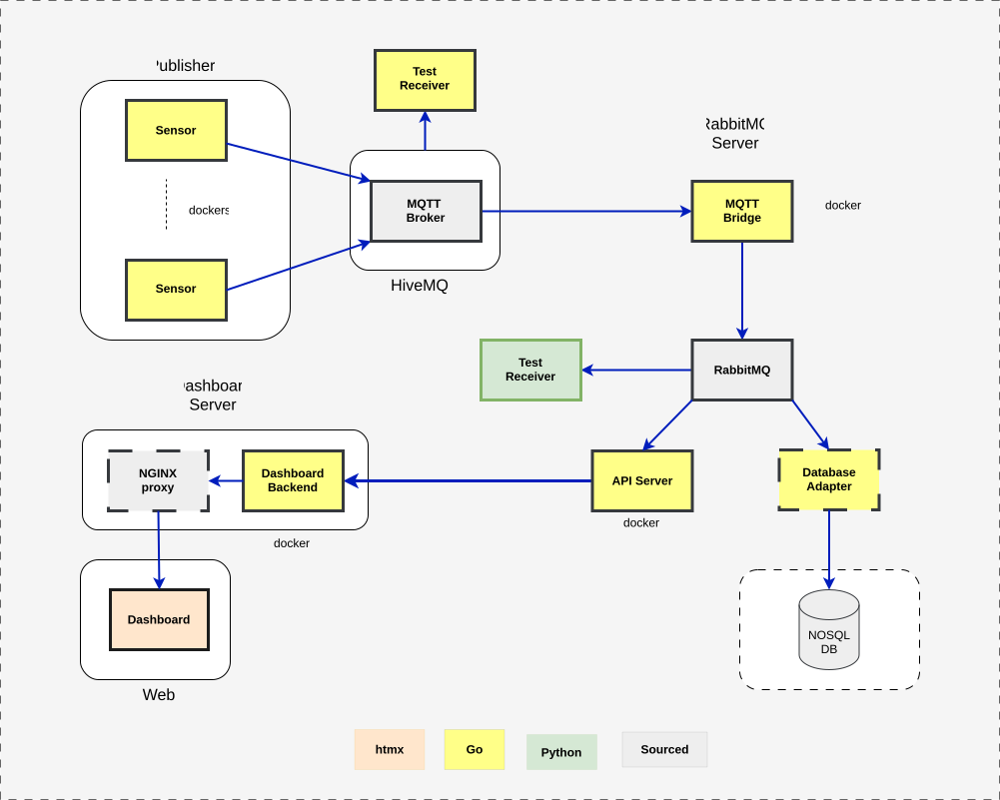

# Streaming Sensor Example

</img>

Items with dotted lines are not implemented yet.

## Sensors (simulated)

- go
- github.com/eclipse/paho.mqtt.golang
- generates configurable wave forms
- docker images
  - sin
  - square
  - triangle

## MQTT Broker

- HiveMQ
  - free tier
  - https://www.hivemq.com/

## MQTT - RabbitMQ Bridge

- go
- github.com/eclipse/paho.mqtt.golang
- github.com/rabbitmq/amqp091-go

## RabbitMQ Server

- rabbitMQ standard docker image
  - https://hub.docker.com/_/rabbitmq

## API Server

- go
- net/http server
- github.com/rabbitmq/amqp091-go

## Dashboard Backend

- go
  - net/http server
  - html/template

## Dashboard Frontend

- hxml SPA

### Test

- MQTT Receiver Test
  - go
  - paho client
    - github.com/eclipse/paho.mqtt.golang
- RabbitMQ Receiver Test
  - python
  - pika client
